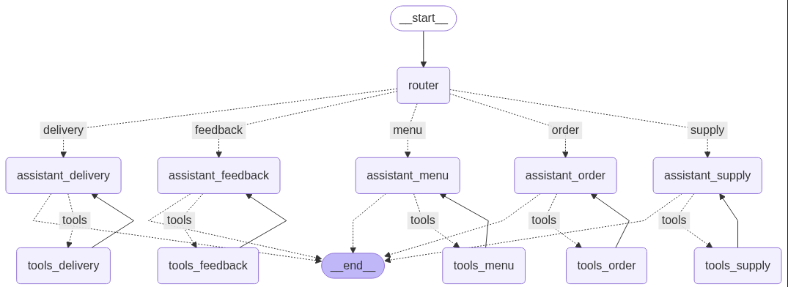
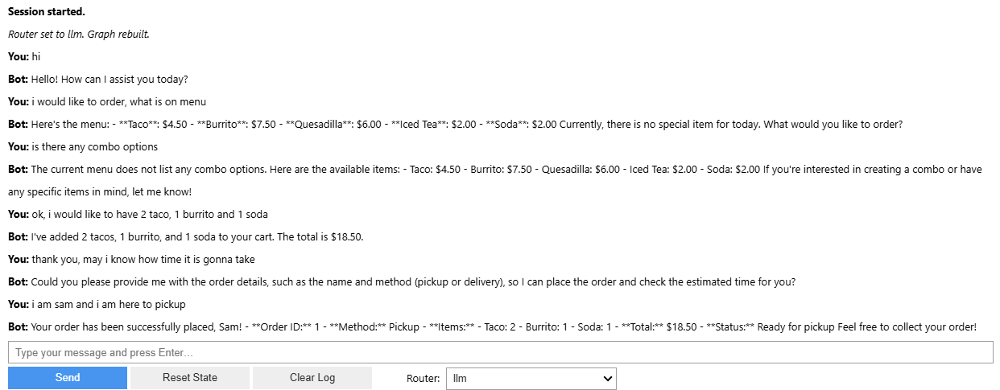

# Food-Truck-Daily-Assistant

A hands-on, multi-agent Food Truck assistant built with LangGraph and LangChain. One message comes in, a router decides which specialist should handle it, and that agent calls real tools to do the work. No guesswork, clear responsibilities, and state that persists to disk.

What this project is

Five focused agents that cover a simple food-truck workflow end to end:
-MenuAgent — reads/updates the menu and today’s special
-OrderAgent — builds a cart, adds/removes items, calculates totals
-SupplyAgent — checks stock, adjusts inventory, flags low-stock items
-DeliveryAgent — finalizes orders, assigns IDs, reports status
-FeedbackAgent — records ratings and summarizes feedback

#LangGraph Architecture

UI result (chat)
A short run placing an order: adding items to cart, checking total, confirming pickup, and viewing order status. You’ll also see inventory updates and a quick feedback entry.

